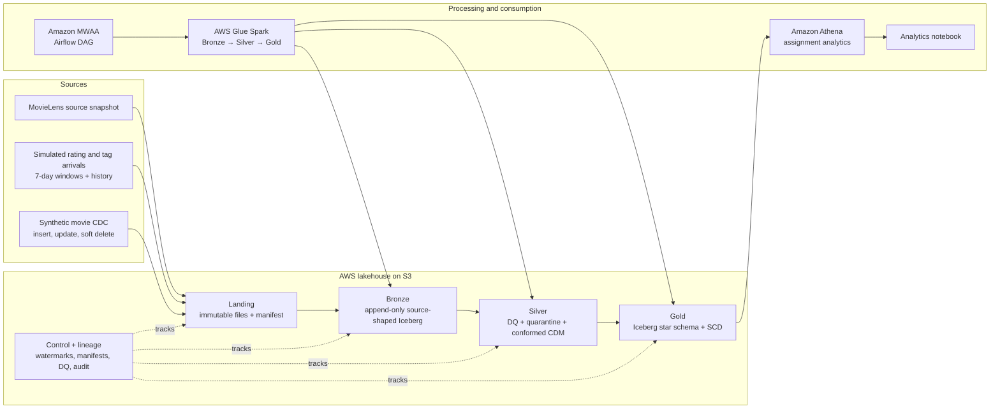
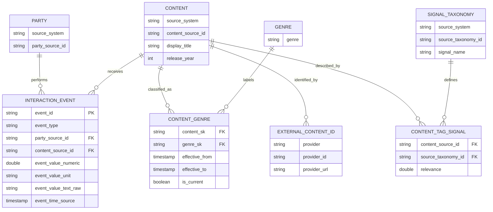

# CineInsight MovieLens Lakehouse

A reproducible data engineering project that turns the MovieLens 20M snapshot and simulated arrivals into a source-independent Common Data Model (CDM), then publishes dimensional tables for analytics. The design targets incremental processing, traceable data quality, late-arriving events, and historical movie classification.

> **Execution status:** The repository contains AWS CDK infrastructure, Glue Iceberg jobs, an MWAA Airflow DAG, and Athena SQL. These are implementation artifacts; they do not prove that the stack has been deployed or that the AWS queries have run. The saved results below come from local source profiling. Run the deployment and Athena queries described in [`infra/README.md`](infra/README.md) to produce cloud execution evidence.

## Project architecture

### Layer responsibilities

| Layer | Contract | Project contents |
|---|---|---|
| Landing | Immutable source files, unchanged; organized by run, source, and batch | Snapshot/bootstrap files, simulated arrivals, CDC files, and manifests/checksums |
| Bronze | Append-only Iceberg, source-shaped values plus file, row, batch, checksum, ingestion-time, and hash lineage | One source table per input; malformed source values remain inspectable |
| Silver | The only layer for parsing, cleansing, conformance, DQ, quarantine, and incremental merge | Validated CDM event and entity tables; bad rows have rule codes/reasons in quarantine |
| Gold | Dimensional model and historical analytics, built incrementally from Silver | Facts, dimensions, bridges, SCD history, and analytics-ready fields |
| Control | Cross-cutting run state and audit trail | File/batch manifests, watermarks, reconciliation and DQ outcomes |

Landing objects are addressed by the run and batch so replayed and late files remain traceable. The current run is `movielens_t2013_daily_v2`, with `T = 2015-01-01` and **seven-day** incremental windows. Its manifest has 13 incremental batches and a history batch. Rating/tag history slices and later arrival batches are the event inputs. Full rating/tag files under `source_snapshot/` are provenance copies, not additional event input. Movie, link, genome score, and genome tag snapshots bootstrap their respective entities/signals.

Glue Spark jobs write Iceberg tables. The DAG in `infra/dags/movielens_incremental_pipeline.py` submits the jobs and waits for completion; Athena runs the SQL in `infra/queries/`. See [`infra/README.md`](infra/README.md) for configuration and deployment instructions, [`docs/simulator.md`](docs/simulator.md) for the arrival fixture, and [`docs/data_model_design.md`](docs/data_model_design.md) for detailed contracts and design choices.

## Common Data Model

The CDM separates business meaning from MovieLens column names and table layout. Identifiers are source-scoped so, for example, MovieLens user `42` cannot accidentally collide with an unrelated provider's user `42`. A future provider adds a source-to-CDM mapping and, where needed, a crosswalk to resolve identities; the shared facts and reporting grain remain stable.

### Source mapping and modeling decisions

| Source | CDM mapping | Meaning / rule |
|---|---|---|
| `rating.csv` | `InteractionEvent` with `event_type=RATING` | Keep original 0.5–5.0 value and unit; `rating_percent = rating × 20` is an optional comparable 0–100 measure. Natural snapshot identity is `(source_system, userId, movieId)`. |
| `tag.csv` | `InteractionEvent` with `event_type=USER_TAG` | Keep raw text and a separately normalized form; tag submission remains a user action, not a content attribute. Snapshot identity is `(source_system, userId, movieId, tag, timestamp)`. |
| Future IMDb ratings / internal viewing logs | Same `InteractionEvent` | Map source IDs, event type, event value and source event time; preserve original value/scale. Example: IMDb 1–10 maps to 10–100, watch percent remains percent. |
| `movie.csv` | `Content` + `ContentGenre` | Preserve raw title; derive release year only when parseable. Split pipe-delimited genres into a bridge. Represent `(no genres listed)` explicitly rather than as a real genre or SQL null. |
| `link.csv` | `ExternalContentId` | Preserve numeric provider IDs and build correctly formatted IMDb/TMDb URLs. IMDb uses `tt` plus a seven-digit zero-padded ID. |
| `genome_tags.csv` + `genome_scores.csv` | `SignalTaxonomy` + `ContentTagSignal` | Algorithm-derived relevance on [0,1], separate from user-submitted tags and ratings. Missing scores mean “not covered,” never zero relevance. |

Event timestamps parse from the source strings, but the files contain no timezone markers. The CDM therefore retains `event_time_raw` and `event_time_source`; it does not claim UTC until the source timezone is confirmed. Every event/entity also carries source lineage such as `source_system`, `batch_id`, `source_file`, Landing URI, record hash, and ingestion metadata.

### Gold dimensional model and SCD

The Gold model has separate facts because each has a different grain. Rating fact grain is one rating event; user-tag fact grain is one tag submission; genome fact grain is one content × taxonomy signal. Dimensions cover content, party, date, genre, signal tag, and external content IDs. A content-genre bridge handles the many-to-many genre relationship. Surrogate keys make historical content versions addressable; source IDs remain available for audit and analysis.

| Attribute | SCD treatment | Reason |
|---|---|---|
| Movie genre membership / soft-delete state | Type 2 | It changes the historical classification. Store effective dates, current flag, version and a version-specific content surrogate key for point-in-time joins. |
| Technical title formatting correction | Type 1 | Correct the current technical value; retain the raw source title for audit. |
| Deliberate title change for previous/current comparison | Type 3 | Store current title, previous title and change time. This answers a one-step comparison; it is not a full history. |
| External ID correction | Type 1 | Current identifier enrichment is enough for this use case; Bronze preserves the source change. |

The synthetic movie CDC demonstrates insert, update and soft delete. A point-in-time genre lookup joins the event time to `effective_from <= event_time < effective_to`; a normal current-state join intentionally answers a different question. Late dimensions should use an inferred member or a controlled re-key/reconciliation when the real dimension arrives.

## Data quality and incremental behavior

- History is loaded once; new event files are selected from the manifest/watermark rather than re-reading the full source snapshot as events.
- Bronze preserves each delivered file as history. Silver merges by stable source event identity and payload hash: identical replay is a no-op; conflicting payload for the same identity must be quarantined or resolved by a documented source version rule.
- Event-time lookback handles late arrivals; ingestion batch/time remains separate from event time. Advance the committed watermark only when required downstream writes and blocking DQ checks succeed.
- Blocking failures stop the dependent pipeline; row-level failures are retained in quarantine with rule ID, reason and lineage. Reconciliation compares the input manifest to Bronze counts/checksums.
- Do not partition by user or movie ID. Profiled rating counts are skewed (median 18 ratings per movie, p95 3,614, maximum 67,310); event-month partitioning is a reasonable starting point for large event tables, while small dimensions should remain unpartitioned until measured.

### Profile evidence from the original snapshot

Profiles are stored in [`data/investigation/`](data/investigation/) and summarized in [`docs/data_model_design.md`](docs/data_model_design.md).

- Ratings: 20,000,263 rows; `(userId, movieId)` unique in this snapshot; valid 0.5 increments in [0.5, 5.0].
- User tags: 465,564 rows; snapshot composite key unique. Conservative NFC/trim/lowercase/whitespace normalization changes 162,625 rows and reduces distinct raw values from 38,644 to 35,162. Seven rows normalize to blank. This catches formatting variation, not semantic synonyms.
- Movies/links: 27,278 each; movie IDs match in both directions. 246 movies have the explicit no-genre sentinel. There are 252 missing TMDb IDs.
- Genome: 11,709,768 unique movie-tag scores; all relevance values are within [0,1]. Coverage is 10,381 / 27,278 movies = **38.06%**; each covered movie has all 1,128 tag scores.
- All six original CSVs have zero full-row duplicate excess, and profiled foreign-key anti-joins found zero orphan rows. These snapshot facts do not replace checks on each simulated batch.

## Business analytics answers

The assignment asks questions numbered 1–4, 7 and 8. Query implementations are in [`infra/queries/assignment_analytics.sql`](infra/queries/assignment_analytics.sql). The source profiles are local measurements; rankings, genre statistics, time trends, correlations, and hidden-gem rows must be produced by running the Gold queries in Athena. No unexecuted query result is represented here as a verified AWS result.

### 1. Movie ranking and vote threshold

Rank by average rating after requiring **at least 500 ratings**; also show rating count. This is a transparent, defensible stability floor: 500 is below the highly rated movie-count p95 of 3,614 but far above the median of 18, excluding many thinly rated titles while retaining a broad catalog. With no floor, titles supported by very few votes can take the top positions due to small-sample volatility. The SQL returns the ranked titles and a no-floor comparison; the exact leaders depend on the current Gold snapshot and should be copied from Athena output into a final report.

### 2. Genre quality, popularity, and disagreement

Explode/bridge each movie's genres, then group rating facts by genre. Report rating count and distinct movie count as popularity measures; report mean rating as quality and sample variance (`VAR_SAMP`) as rating disagreement. A multi-genre film contributes its ratings to each assigned genre, so genre counts are associations and are not mutually exclusive. The query identifies the highest-variance genre after a minimum of 500 ratings to limit unstable small groups. The checked profile establishes Drama (13,344) and Comedy (8,374) as the most common **movie-genre associations**; that is not the rating-count ranking and does not establish which genre has highest variance.

### 3. Trends by release year and rating time

Extract the terminal four-digit year from title while retaining parse status and raw title; group ratings by release year for catalog-era comparison. Separately group by the event timestamp's calendar month and report count and mean rating. The event-time series reflects when users rated films, not when films were released. Preserve the source's timezone-naive semantics in chart labels until timezone is confirmed. The profile parsed a terminal year for 27,256 titles; 3 were year ranges and 19 lacked a recognizable terminal year.

### 4. Popular tags and tag/rating association

Normalize conservatively with Unicode NFC, trim, lowercase and whitespace collapse; keep raw text and normalization version. Exclude normalized blank values, then rank tags by submissions and show distinct users/movies. For association, aggregate tag submissions per movie and correlate that count with the movie's average rating; the supplied SQL requires at least 30 movies per tag. This is descriptive association, not causal effect. Do not merge punctuation or synonym variants without a curated mapping. The local profile found 35,162 normalized distinct tag values after conservative normalization, but does not include the top-tag or correlation result.

### 7. Genome description and catalog coverage

Describe a selected movie by its strongest genome relevance signals joined to their taxonomy labels; the supplied query demonstrates MovieLens IDs 1, 2 and 3 and orders each movie's signals by relevance. Genome scores are algorithm-derived content descriptors, distinct from user tags. The profiled catalog coverage is **38.06%** (10,381 of 27,278 movies). Each covered movie has the full set of 1,128 scores, so uncovered movies must be reported as not covered rather than assigned zero relevance.

### 8. Hidden gems and external URLs

The query defines a hidden-gem candidate as an active movie with at least 100 ratings, average rating at least 4.0, and genome coverage below 25% of the 1,128-tag taxonomy. This balances a minimum evidence threshold for quality with limited descriptive coverage; it is an explicit analytic definition that can be adjusted and explained. Candidates include average, count, coverage, and provider URLs. Construct IMDb as `https://www.imdb.com/title/tt` + IMDb ID left-padded to 7 digits + `/`; construct TMDb as `https://www.themoviedb.org/movie/<tmdbId>`. Null provider IDs produce no URL. Run the query to obtain the candidate list; no candidate rows are claimed here without AWS query output.

## Running and submitting

1. Review [`infra/README.md`](infra/README.md), set local configuration from `.env.example`, and authenticate using an AWS profile or role. Do not commit credentials or `.env`.
2. Deploy the CDK foundation, upload the selected run and manifest, then run/reconcile one Bronze batch before expanding to all batches.
3. Run Bronze → Silver → Gold incrementally. Inspect control, DQ and quarantine outputs, then verify table counts and point-in-time SCD behavior.
4. Run the assignment SQL in Athena, export the result tables/charts to the notebook, and include those outputs in the final report. Export the notebook to HTML as required by the assignment.

Relevant implementation and design files:

- [`infra/stack.py`](infra/stack.py) — AWS CDK foundation resources
- [`infra/jobs/bronze_ingest.py`](infra/jobs/bronze_ingest.py), [`infra/jobs/silver_merge.py`](infra/jobs/silver_merge.py), [`infra/jobs/gold_build.py`](infra/jobs/gold_build.py) — Glue processing
- [`infra/dags/movielens_incremental_pipeline.py`](infra/dags/movielens_incremental_pipeline.py) — MWAA Airflow DAG
- [`infra/queries/assignment_analytics.sql`](infra/queries/assignment_analytics.sql) — answers/queries for assignment questions
- [`infra/queries/verification.sql`](infra/queries/verification.sql) — table and reconciliation checks
- [`docs/data_model_design.md`](docs/data_model_design.md) — source mapping, DQ, SCD, partitioning and lineage design
- [`analytics.ipynb`](analytics.ipynb) — analytics notebook
